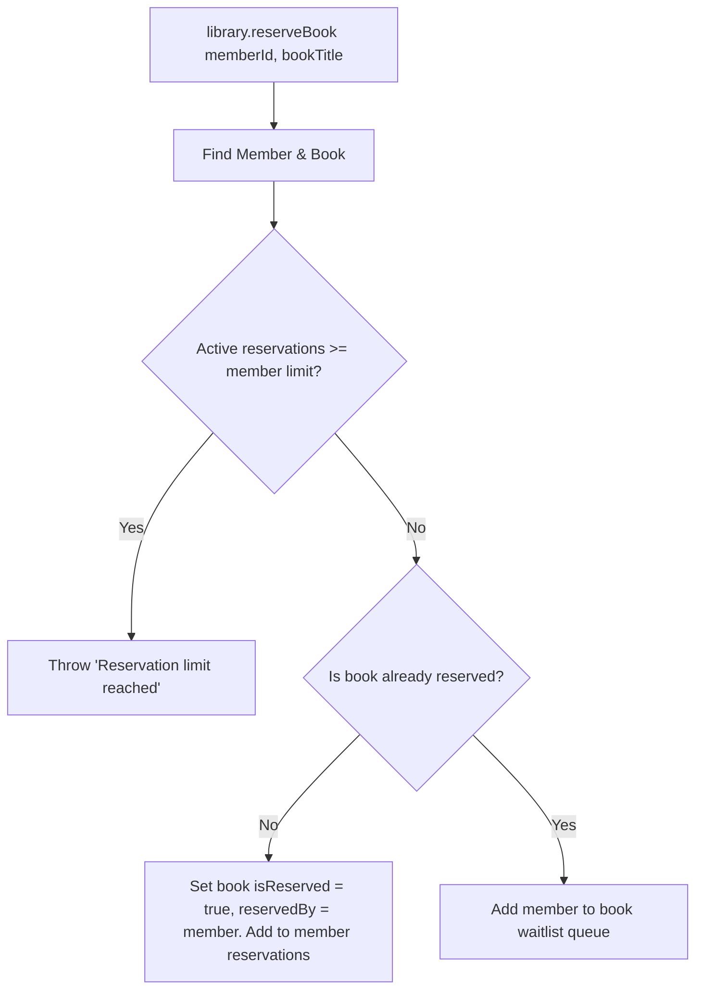

# Library Book Reservation System

A complete TypeScript and Node.js Library Book Reservation System designed with core Object-Oriented Programming (OOP) principles and classic software design patterns.

## Table of Contents
1. [Project Description](#project-description)
2. [Features](#features)
3. [Technologies Used](#technologies-used)
4. [Installation Instructions](#installation-instructions)
5. [How to Run the Application](#how-to-run-the-application)
6. [How to Run Tests](#how-to-run-tests)
7. [Project Folder Structure](#project-folder-structure)
8. [Architecture Explanation](#architecture-explanation)
9. [OOP Principles Used](#oop-principles-used)
10. [Factory Pattern Explanation](#factory-pattern-explanation)
11. [Observer Pattern Explanation](#observer-pattern-explanation)
12. [Reservation Workflow](#reservation-workflow)
13. [Fine Calculation Explanation](#fine-calculation-explanation)

---

## Project Description
This project is an in-memory, object-oriented backend library book reservation system. It allows the registering of different member types with varying borrowing limits, reserving books, queuing members onto a waitlist when books are unavailable, notifying waitlisted members when a book is returned, and automatically transferring the reservation to the next member in the waitlist in a First-In-First-Out (FIFO) manner. It also handles calculating fines for overdue book reservations.

## Features
- **Flexible Membership Management**: Supports Standard, Student, and Staff memberships with distinct reservation limits.
- **Robust Reservation Checking**: Verifies active borrowing limits before a book can be reserved or a member can join a waitlist.
- **FIFO Waitlist Queue**: Resolves waitlists automatically when a book is returned, transferring ownership to the next waitlisted member in a strictly chronological queue.
- **Observer Notifications**: Notifies all waitlisted members simultaneously when their desired book becomes available.
- **Fine System**: Calculates exact overdue fines based on outstanding reservations and days overdue.
- **Complete Test Coverage**: Includes Jest tests covering member creation, reservations, waitlists, FIFO state transitions, and fine logic.

## Technologies Used
- **Node.js** (v20+)
- **TypeScript** (v5+)
- **Jest** (Testing Framework)
- **ts-jest** (TypeScript preprocessor for Jest)
- **ts-node** (Direct TypeScript execution engine)

## Installation Instructions
Ensure you have Node.js installed, then run the following command in the project root folder to install all required dependencies:

```bash
npm install
```

## How to Run the Application
You can run the executable demonstration of the reservation system by running:

```bash
npm start
```
This runs the file `src/index.ts` showing a lifecycle of adding books, registering members, reserving, waitlisting, returning books, and waitlist transitions.

## How to Run Tests
To run the automated test suite, use the command:

```bash
npm test
```

To run a static type check using the TypeScript compiler:

```bash
npx tsc --noEmit
```

## Project Folder Structure
```text
library-reservation-system/
├── src/
│   ├── Book.ts              # Represents a book (Subject)
│   ├── Member.ts            # Abstract Member base and subclass implementations (Observer)
│   ├── MemberFactory.ts     # Instantiates member subclasses (Factory Pattern)
│   ├── Library.ts           # Central library facade (Facade Pattern)
│   └── index.ts             # Executable demo script
│
├── tests/
│   └── Library.test.ts      # Comprehensive Jest unit test suite
│
├── package.json             # Scripts, dependencies, and configuration
├── tsconfig.json            # TypeScript compiler configuration
├── jest.config.js           # Jest test runner configuration
├── README.md                # System documentation
└── .gitignore               # Ignored folders configuration
```

## Architecture Explanation
The system operates as an **in-memory OOP backend**. The central facade is the [Library](src/Library.ts) class, which acts as the unified entry point. It manages collections of Books and Members. Members are created using a Factory, ensuring separation of concerns and encapsulation of creation logic. The relationship between waitlisted members and a book is managed using the Observer pattern: the [Book](src/Book.ts) is the **Subject**, and the [Member](src/Member.ts) is the **Observer**.

## OOP Principles Used
- **Abstraction**: Represented by the abstract `Member` class, separating the interface definition and core observer implementation from specific member subclass details.
- **Inheritance**: `StandardMember`, `StudentMember`, and `StaffMember` inherit common attributes, methods (like `update`), and state management from the abstract base class `Member`.
- **Polymorphism**: The `update(book: Book)` method is shared across all member types, allowing the `Book` subject to notify them uniformly regardless of their specific membership subclass.
- **Encapsulation**: Classes restrict direct access to fields using visibility modifiers (such as `private _waitlist` in `Book`). Safe copies are exposed (`getWaitlist()`) to prevent external callers from modifying internal waitlist arrays directly.

## Factory Pattern Explanation
The [MemberFactory](src/MemberFactory.ts) contains a static method `createMember(type: string, name: string): Member` that decides which subclass to instantiate based on the `"type"` argument. This shields the [Library](src/Library.ts) from details regarding subclass construction, limits, and automatic ID generation.
Invalid types (e.g. `"guest"`) are rejected immediately, preventing corrupt states.

## Observer Pattern Explanation
The Observer pattern notifies waitlisted members when their desired book becomes available.
- **Subject**: [Book](src/Book.ts) maintains a list of waitlisted members (`_waitlist`).
- **Observer**: [Member](src/Member.ts) defines an `update(book: Book)` method.
- When `returnBook()` is called, the book notifies all members in its waitlist before transferring the reservation. This notifies all interested parties that the book was returned and is changing availability.

## Reservation Workflow


## Fine Calculation Explanation
Overdue fines are calculated at a rate of **$0.50 per overdue day**. Fines are calculated based on whole days:
$$\text{Fine} = \text{Whole Days Overdue} \times \$0.50$$
To avoid date/time rounding issues, the calculation computes the elapsed time difference in milliseconds between the comparison date and the reservation's `dueDate`. If positive, it divides by the duration of a day in milliseconds ($1000 \text{ ms} \times 60 \text{ s} \times 60 \text{ m} \times 24 \text{ h}$) and applies `Math.floor()` to determine integer overdue days.
